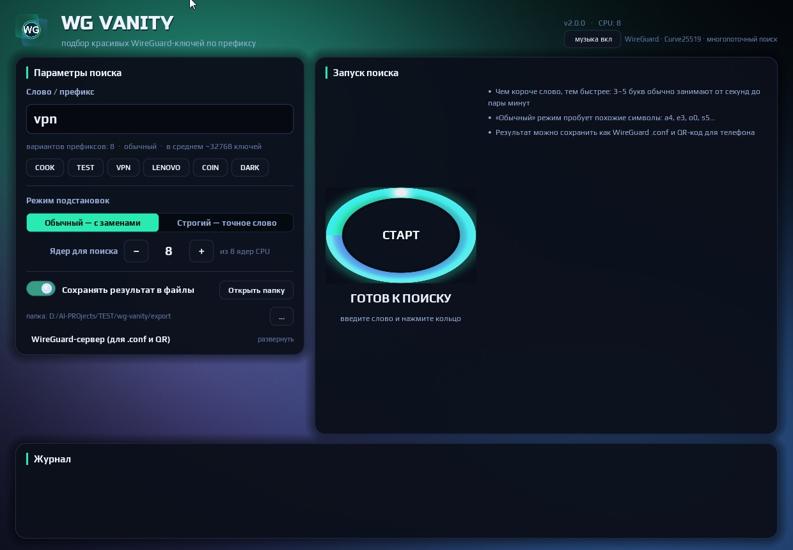

# wg-vanity

Поиск **vanity-ключей WireGuard** — публичных ключей, начинающихся с заданного префикса,
используя криптографически корректные Ed25519 ключи (PyNaCl) и все ядра CPU.

> 🔍 **Описание**
>
> Проект позволяет искать публичные ключи WireGuard, которые начинаются с заданного
> префикса (Vanity-ключи). Используется Python и библиотека `PyNaCl` для генерации
> корректных Ed25519 ключей, с многопроцессорным поиском и статистикой в реальном времени.



---

## 🏛 Две версии

| | Версия | Стек | Для кого |
|---|--------|------|----------|
| 🖥 **CLI v1** | [`wg_vanity.py`](wg_vanity.py) | Python, консоль | скрипты, headless-сервер, автоматизация |
| 🎨 **GUI v2** | [`v2/`](v2/README.md) | Godot 3.6.3 + Python-воркер | «очень красивый» интерфейс, статистика, QR, музыка |

---

## 🚀 Быстрый старт (GUI v2, готовый билд)

Скачайте **WG_Vanity_v2.exe** из [Releases](../../releases) — портативный `.exe`,
внутри уже вшит воркер, работает на слабых GPU (GLES2). Не устанавливает ничего.

Введите **слово** (например `bitcoin` или `vpn`), выберите число воркеров,
нажмите **«Найти»** — и следите за живой статистикой. При нахождении ключ
сохраняется (`.conf`, `_keys.txt`, `_qr.png`) рядом с exe.

Полная сборка из исходников v2 — см. [`v2/README.md`](v2/README.md).

---

## ⌨️ CLI v1 (Python)

### Возможности

- Генерация ключей с заданным префиксом.
- Поддержка замены символов на `leet` (например, `a → 4`, `i → 1`).
- Многопроцессорная генерация для ускорения на CPU.
- Вывод статистики: проверенные ключи, скорость, оценочное время.
- Сохранение найденных ключей в файл с отметкой времени.

### Установка

```bash
git clone https://github.com/larin-ilya/wg-vanity.git
cd wg-vanity
pip install pynacl
```

### Использование

```bash
python wg_vanity.py -w MYNAME                    # базовое слово
python wg_vanity.py -w bitcoin --workers 4 --save
```

| Аргумент     | Описание                                                 |
| ------------ | -------------------------------------------------------- |
| `-w, --word` | Базовое слово для генерации префиксов (обязательно)      |
| `--workers`  | Количество рабочих процессов (по умолчанию = кол-во CPU) |
| `-s, --save` | Сохранять найденные ключи в файл                         |

---

## 🔒 Лицензия

MIT. См. [LICENSE](LICENSE).
