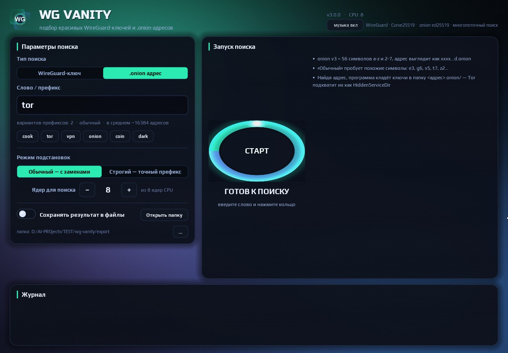

# wg-vanity

Поиск **vanity-ключей WireGuard** и **красивых Tor .onion v3-адресов** —
публичных ключей/адресов, начинающихся с заданного префикса, используя
криптографически корректные Ed25519/Curve25519 ключи (PyNaCl) и все ядра CPU.



---

## 🏛 Три версии

| | Версия | Стек | Для кого |
|---|--------|------|----------|
| 🖥 **CLI v1** | [`wg_vanity.py`](wg_vanity.py) | Python, консоль | скрипты, headless-сервер, автоматизация |
| 🎨 **GUI v2** | [`v2/`](v2/README.md) | Godot 3.6.3 + Python-воркер | поиск WireGuard-ключей |
| ✨ **GUI v3** | [`v3/`](v3/README.md) | Godot 3.6.3 + Python-воркер | WireGuard **и** .onion v3, lofi-музыка, эффекты |

---

## 🚀 Быстрый старт (GUI v3, готовый билд)

Скачайте **WG_Vanity_v3.exe** из [Releases](../../releases) — портативный `.exe`,
внутри уже вшит воркер, работает на слабых GPU (GLES2). Не устанавливает ничего.

Выберите тип поиска в левой колонке:

- **WireGuard-ключ** — введите слово (например `bitcoin` или `vpn`). Найденный
  ключ сохраняется: `.conf`, `_keys.txt`, `_qr.png`.
- **.onion адрес** — введите префикс из `a–z` и `2–7` (например `cook`, `tor`,
  `coin`). При находке создаётся каталог `<адрес>.onion/` с готовыми для Tor
  файлами: `hostname`, `hs_ed25519_public_key`, `hs_ed25519_secret_key`.

Нажмите **«Найти»** — и следите за живой статистикой поиска.

Полная сборка из исходников v3 — см. [`v3/README.md`](v3/README.md).

---

## ⌨️ CLI v1 (Python)

### Возможности

- Генерация WireGuard-ключей с заданным префиксом.
- Поддержка замены символов на `leet` (например, `a → 4`, `i → 1`).
- Многопроцессорная генерация для ускорения на CPU.
- Вывод статистики: проверенные ключи, скорость, оценочное время.
- Сохранение найденных ключей в файл с отметкой времени.

### Установка

```bash
git clone https://github.com/larin-ilya/wg-vanity.git
cd wg-vanity
pip install pynacl
```

### Использование

```bash
python wg_vanity.py -w MYNAME                    # базовое слово
python wg_vanity.py -w bitcoin --workers 4 --save
```

| Аргумент     | Описание                                                 |
| ------------ | -------------------------------------------------------- |
| `-w, --word` | Базовое слово для генерации префиксов (обязательно)      |
| `--workers`  | Количество рабочих процессов (по умолчанию = кол-во CPU) |
| `-s, --save` | Сохранять найденные ключи в файл                         |

---

## 🔒 Лицензия

MIT. См. [LICENSE](LICENSE).
